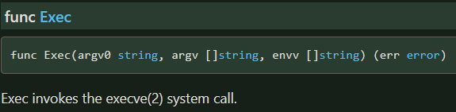
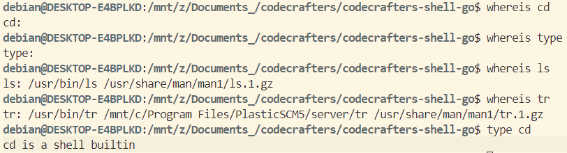
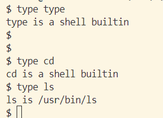
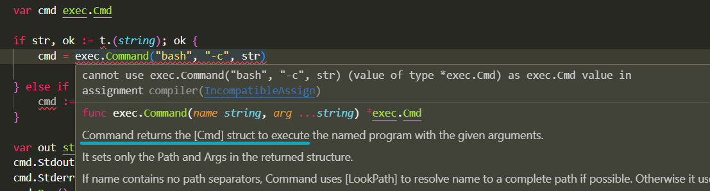
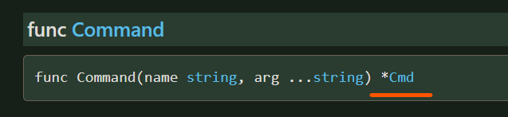

## Execute shell commands from go
- Using `syscall.Exec`:

    `fmt.Println(syscall.Exec("/usr/bin/ls", []string{"-al"}, []string{""}))`  

    - We have to pass the whole absolute path of the command
    - notice the 2nd and 3rd array arguemnts.
    - https://pkg.go.dev/syscall#Exec

- `exec.Command` from os package.... **os/exec** pakcage to be more precise.
    -  https://pkg.go.dev/os/exec
    - 1. Build the 'Command' struct. 2. set the StdOut to a buffer or string's pointer. 3. Run the command. 4. Print the output of pointer
    -  
        ```go
            cmd := exec.Command("ls")
            var out strings.Builder
            cmd.Stdout = &out
            // cmd.Start()
            cmd.Run()
            // cmd.Wait()
            fmt.Println(out.String())
    - Above code prints the `ls` command output. But it does not work with `type` command.
    - `ls` or `tr` command is accessible from /usr/bin. But commands such as `type` or `cd` are not: 
    - [The docs](https://pkg.go.dev/os/exec#example-Command) also use `exec.Command` as above...
        -  	`cmd := exec.Command("tr", "a-z", "A-Z")`
    - But We can see the. This is the workaround, execute bash first with others as arguments. "-c" flag treats the later arguments as commands(`type echo`)=>
        ```go
        cmd := exec.Command("bash", "-c", "type echo") // this must be surrounded by _quotes_.
        var out strings.Builder
        cmd.Stdout = &out
        cmd.Stderr = &out 
        err := cmd.Run()
        if err != nil {
            fmt.Println("Error:", err)
        }
        fmt.Println(out.String())

        ```
    -   if it doesn't work, run this code within **wsl**(debian etc.), not powershell.
    -

## Troubleshooting: Type Issue?
- This code is throwing error `declared and not used: cmdcompilerUnusedVar`. reason?

    ```go
    if str, ok := t.(string); ok {
        cmd := exec.Command("bash", "-c", str)

    } else if arr, ok := t.([]string); ok {
        cmd := exec.Command(arr[0], strings.Join(arr[1:], " "))
    }
    var out strings.Builder
    cmd.Stdout = &out
    ```
	
- `exec.Command` returns the struct `exec.Cmd`. Added this line in the beginning: `var cmd exec.Cmd`
- New error on line `cmd = exec.Command("bash".....)`
    
- Even though it says Command returns a Cmd struct, actually it returns a pointer to the `exec.Cmd` struct. [docs ](https://pkg.go.dev/os/exec#Command)
- This is the error-free code:
    ```go
        var cmd *exec.Cmd

        if str, ok := command_words.(string); ok {
            cmd = exec.Command("bash", "-c", str)

        } 
        var out strings.Builder
        cmd.Stdout = &out
        cmd.Stderr = &out

        cmd.Run()
        fmt.Printf("%s", out.String())
    ```
- 